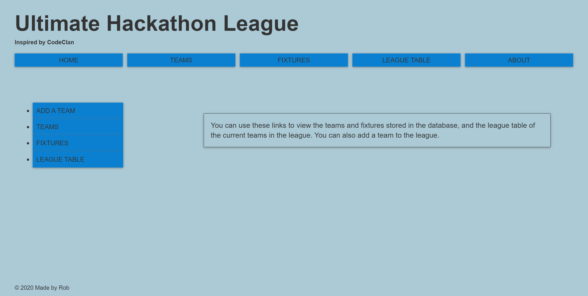
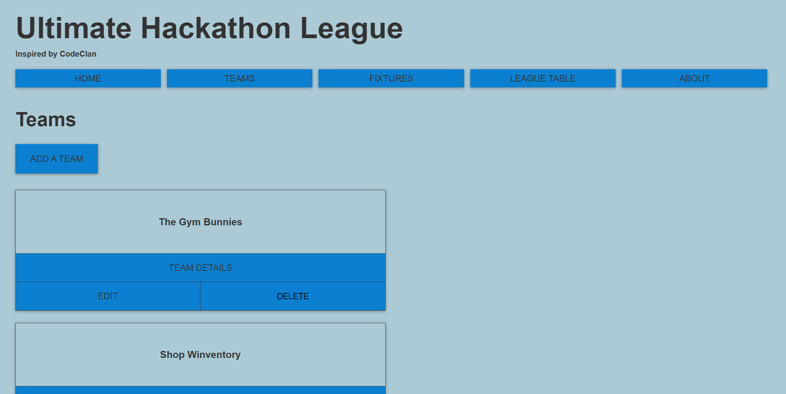
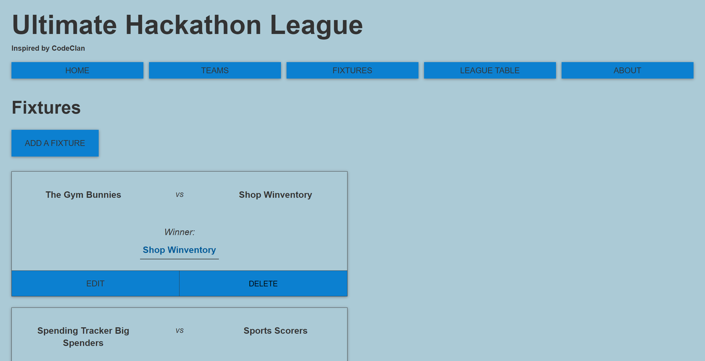
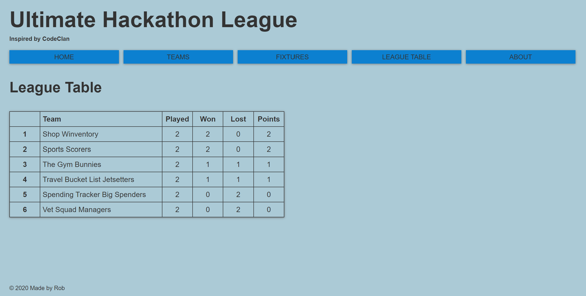

# Sports Scoring App v2

### An app for showing Teams and Fixtures in a League



This is _version 2_.

I created _version 1_ using **Ruby** and **Sinatra** as my first project during week 5 (August 2019) of the CodeClan Professional Software Development course.

Upon completion of the course I have recreated the app using different languages and frameworks in order to further understand implementation of functionality and design choices.

Since _version 1_ was created using a Mac I felt it would be beneficial to recreate it on Windows from scratch. I began work on _version 2_ in December 2019.

Other versions:

- Version 1: [Sports Scoring App - Ruby & Sinatra (created on a Mac)](https://github.com/rcarmitage/codeclan_solo_project-sports_scoring_app_v1.0_ruby_sinatra)
- Version 3: [Sports Scoring App - JavaScript & Vue](https://github.com/rcarmitage/codeclan_solo_project-sports_scoring_app_v3.0_javascript_vue)
- Version 4: [Sports Scoring App - JavaScript & React Front-End | Node.js, Express & PostgreSQL Back-End](https://github.com/rcarmitage/codeclan_solo_project-sports_scoring_app_v4.0_javascript_react)

## Brief

### MVP:

A user should be able to…

- Create, edit and delete Teams to the League
- Create, edit and delete Fixtures
- There should be a way to display all the Fixtures for a Team and all the Teams involved in a Fixture
- The app should display if a Fixture was won or lost

### Extensions:

- Create a League Table to see who is on top of the League
- Self-selected extension: Add "Play a Game" functionality, i.e. the user would select two Teams and the app would select a winner from these

## Running the App After Pulling from GitHub

### Installation

Create a database called sports_scoring_app

```
createdb sports_scoring_app
```

Navigate to the `db` folder then link the sports_scoring_app database to sports_scoring_app.sql

```
psql -d sports_scoring_app -f sports_scoring_app.sql
```

Launch Sinatra and create the web environment

```
ruby app.rb
```

Browse to [http://localhost:4567](http://localhost:4567)

### Using the Sports Scoring App

You can create Teams to add them to the Teams list and the League Table. They will be created with 0 games Played, Won, Lost and 0 Points.

You can populate the database with prepared data by running the seeds file

```
ruby db/seeds.rb
```

## App Details

- From Home you can select to view the Teams list, the Fixtures list, or the League Table. You can also navigate straight to the Add Team page.

- The Teams page lists all Teams in the League. You can edit or delete an individual Team, view the Team details, or add a Team to the League.



- The Fixtures page lists all the Fixtures between Teams in the League. You can edit the Teams in a Fixture and who the winning and losing Teams are, or delete a Fixture.



- The League Table page shows the Teams displayed by Points awarded.



Status of the app and plans for further development as of 29th January 2020:

- The framework of the Home, Teams, Fixtures, League Table and About pages is complete. The data is displayed as per the design.
- The individual Team pages do not show any information other than the Team name. I plan to display all the Fixtures for that Team on this page, displaying whether they won or lost.
- The Add Fixture functionality is not finished. It initially worked with the user manually typing in the team ID numbers, however recent updates to the app have removed this functionality. I plan to provide a list with all teams in the database from which the user will select two, and then a winner and a loser from these. The ADD FIXTURE button will post this to the database and the Fixture will be added to the list on the Fixtures page. This will also increase the Teams' played, won, lost and points entries as appropriate, which will update the League Table.
- The DELETE button on the Teams page produces an error if the Team has any foreign key entries in the Fixtures table.
- CSS: There is lots of replication in the `structure.css` file. I plan to refactor this by giving IDs to many of the elements and consolidating the majority of the instructions into a small number of classes. I also plan to finish implementing the `buttons.css` instructions to the DELETE buttons on the Teams and Fixtures pages, and to make the Teams, Fixtures and League Table page content adjust to different screen sizes.
- I have tried to upload and display this and _version 1_ on Heroku, however I have had difficulty with gems that have produced errors when trying to push to Heroku. I plan to resolve these errors and display this app for users to test.

## My learning

- I found it very useful to go through the process of creating the app on Windows. I now understand more about each step of the process and why it is necessary.
- I was able to spend more time on the presentation of the app after the course than I could during the 6-day project timeframe within the course. The data for the Teams and Fixtures pages were displayed in a simple manner in _version 1_, and in _version 2_ I was able to present it more clearly for the benefit of the user.
- I created the League Table using an SQL query to sort the data by Points (descending) and then listing this in a CSS grid. I came up against some barriers in getting the data to display on the page but I am pleased that my initial method of achieving this task and the content of my SQL query were sound, and the difficulties largely came from unexpected lags in changes showing up through Sinatra. Once I had moved past these issues it was straightforward to complete the League Table and present the data as per my original design.
- Combining information from the notes provided by CodeClan with that from other sources (documentation, blogs, video tutorials) helped me contextualise my knowledge and start to understand the wider implementation of **Ruby**, **Sinatra** and general programming principles.
- I have more faith in my ability to complete a project to a good standard. I became stuck on a few areas and found ways to complete the tasks by thinking about different methods to solve the problem or by trying to understand the gaps in my knowledge.
